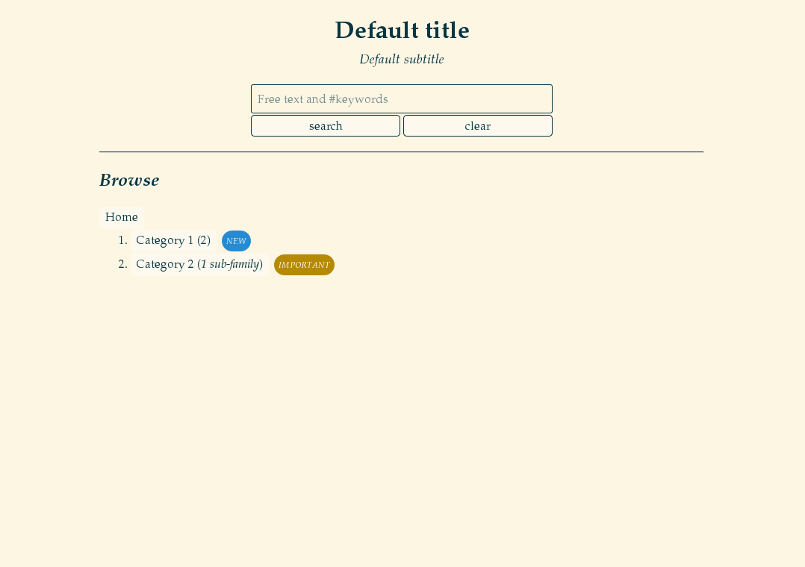

GraphDash
=========

`GraphDash` is a web-based dashboard built on graphs and their metadata.
For example, if you have two graphs in a directory:

```bash
$ cd default_graph_dir
$ ls
graph.svg graph2.svg
```

Then you can create two metadata files using YAML format,
where you can configure how the graphs will be displayed:

```bash
$ cat graph.yaml
name: graph.svg
family: 'Category 1'
title: '*Real serious* graph'
text: |
    The description

$ cat graph2.yaml
name: graph2.svg
family: 'Category 2'
title: 'Another important graph'
```

You may then start the graph dashboard. You will get a nice web interface
displaying your graphs, and a search box with autocompletion.
You can easily navigate and share your graphs.

```bash
$ GraphDash --root .
* Running on http://0.0.0.0:5555/ (Press CTRL+C to quit)
```



Installation
------------

Clone and install (in user space):

```bash
git clone https://github.com/AmadeusITGroup/graphdash.git
cd graphdash
pip install --user .
```

Or use the Python package:

```bash
pip install --user graphdash
```

Launch the webapp
-----------------

For user-space installation, make sure your `$PATH` includes `~/.local/bin`.

```bash
$ GraphDash -r default_graph_dir
* Running on http://0.0.0.0:5555/ (Press CTRL+C to quit)
```

The dashboard can be configured with a YAML config file and the `-c/--conf` option:

```bash
$ cat docs/graphdash.yaml
root: ../default_graph_dir
title: "Example of title ;)"
subtitle: "Example of subtitle"

$ GraphDash -c docs/graphdash.yaml
* Running on http://0.0.0.0:5555/ (Press CTRL+C to quit)
```

You can generate a template of configuration file:

```bash
$ GraphDash -C template.yaml
```

Serve with Gunicorn
-------------------

If not already installed on your machine, install `Gunicorn`:

```bash
pip install --user gunicorn # on Fedora you may need to install libffi-devel before
```

Since you can import the webapp through `graphdash:app`, you can serve it with `Gunicorn`:

```bash
gunicorn -b 0.0.0.0:8888 --pid server.pid graphdash:app
```

The configuration file of the webapp can be set with the `CONF` environment variable.
With `Gunicorn`, you can pass environment variables to the workers with `--env`:

```bash
gunicorn -b 0.0.0.0:8888 --pid server.pid --env CONF=docs/graphdash.yaml graphdash:app
```

But you should *not* use these commands yourself, that is what `GraphDashManage` is for!

GraphDashManage
---------------

`GraphDashManage` is used to `start`, `stop`, `restart` the
instances of `Gunicorn` serving `graphdash:app`. It needs a
configuration file in the current directory:

```bash
$ cat settings.sh
ALL_MODES=(
   ['prod']="docs/graphdash.yaml"
   ['test']="docs/graphdash.yaml"
)
ALL_PORTS=(
   ['prod']=1234
   ['test']=5678
)
WORKERS=3
```

Then you can manage multiple instances of `GraphDash` using `Gunicorn` with:

```bash
$ GraphDashManage start prod
[INFO] Listening at: http://0.0.0.0:1234
[INFO] Booting worker with pid: 30403
[INFO] Booting worker with pid: 30404
[INFO] Booting worker with pid: 30405

$ GraphDashManage start test
[INFO] Listening at: http://0.0.0.0:5678
...
```

You can generate a template of settings:

```bash
$ GraphDashManage template > template.sh # to be moved to settings.sh
```

Webapp configuration file
-------------------------

Possible entries (everything is optional):

-   `root`: the root directory of the graphs
-   `families`: path to the families metadata file (optional)
-   `title`: the title of the webapp
-   `subtitle`: the subtitle of the webapp
-   `placeholder`: the default text in the search field
-   `header`: an optional message at the top (markdown syntax)
-   `footer`: an optional message at the bottom (markdown syntax)
-   `showfamilynumbers`: a boolean to toggle family numbering (default is true)
-   `showgraphnumbers`: a boolean to toggle graph numbering (default is true)
-   `theme`: change css theme (default is dark)
-   `keep`: the proportion of common words kept for autocompletion
-   `logfile`: change default log file of the webapp
-   `raw`: when loading, look for all graphs and ignore metadata
-   `verbose`: a boolean indicating verbosity when loading application
-   `debug`: debug mode (enable Grunt livereload, enable Flask debug mode)
-   `headless`: headless mode (only search is available, no page is rendered)
-   `port`: when launched with Flask development server only, port

Graph metadata
--------------

Several attributes are supported:

-   `name`: the path to the graph
-   `title`: title of the graph, recommended for display purposes (markdown syntax)
-   `family`: the subsection in which the graph is
-   `index`: an optional list of keywords describing the graph (useful for search feature)
-   `text`: an optional description of the graph (markdown syntax)
-   `pretext`: an optional message appearing before the graph (markdown syntax)
-   `file`: optional path to the raw data
-   `export`: optional path to the exportable graph (for example, a PNG file)
-   `rank`: integer, optional value used to change graphs order (default uses titles)
-   `showtitle`: a boolean to toggle title display for the graph (default is false)
-   `labels`: a list of labels (like `'new'`) which will be rendered in the UI as colored circles
-   `other`: other metadata not used by `GraphDash`, but may be needed by other things reading the metadata

Note that if the `name` attribute is missing, the graph will not be
shown and the text will be displayed anyway, like a blog entry.

Family metadata
---------------

You may put a `.FAMILIES.yaml` file at the root of the graph directory.
This file may contain metadata for families. It should be a YAML list:

```yaml
- family: chairs
  rank : 0
- family: tables
  rank : 1
  text: This is a description
  alias: This text will appear instead of "tables"
  labels: new
```

Each element of the list should be a dict containing:

-   `family`: the family considered
-   `rank`: integer, optional value used to change families order (default
    uses family name)
-   `text`: an optional description of the family (markdown syntax)
-   `alias`: an optional name who may be longer than the one in the url
    (useful to build nice urls)
-   `labels`: a list of labels (like `new`) which will be rendered in the
    UI as colored circles

Available labels are `new`, `update`, `bugfix`, `warning`, `error`,
`ongoing`, `obsolete`. You may give other labels which will be rendered
with defaults colors. For customization, you may specify your own labels
with a dict syntax:

```yaml
labels:
- name: newlabel
  color: white
  text_color: black
  text: "NEW LABEL"
  tooltip: null
```

Development
-----------

If you wish to contribute, you need `Grunt` to generate new css/js files
from sass/coffee source files.

```bash
npm install --no-bin-links # may need to repeat
grunt
```

Debugging can be made with source map files for browser supporting them
in their debugging tools. If not, the `Gruntfile.js` enables an option
to generate non-minified assets.

```bash
grunt --dev
```

With the `debug` mode enabled, Grunt will use the livereload mechanism
to reload the browser if any file has changed (and Flask debug mode will
reload the server as well).

```bash
GraphDash --debug & # or python -m graphdash
grunt watch
```

If you used `Gunicorn` with a PID file, Grunt will automatically reload it
if any Python files change.

```bash
gunicorn -b 0.0.0.0:8888 --pid server.pid graphdash:app &
grunt watch
```

You can use `tox` build packages and run tests.

```bash
tox
```
